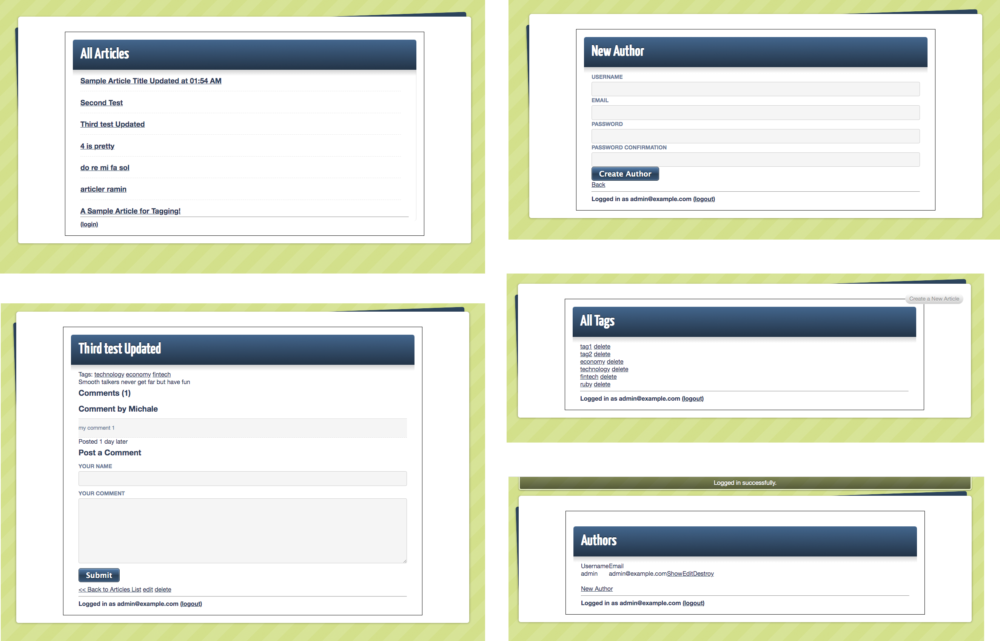

Microverse Rail Project #2 -> Blog App



In this project we created a simple blog system and learn the basics of Ruby on Rails.

- [x] Miltestone 1 - Models, Views, and Controllers (MVC)
- [x] Miltestone 2 - Data Structures & Relationships
- [x] Miltestone 3 - Routing
- [x] Miltestone 4 - Migrations
- [x] Miltestone 5 - Views with forms, partials, and helpers
- [x] Miltestone 6 - RESTful design
- [x] Miltestone 7 - Adding gems for extra features


## Built With
- Ruby on Rails

## Liters
- Rubocop
- Stylelint

## Getting Started

To get a local copy up and running follow these simple example steps.

### Install
Besides the live demo link, you can run those functions in you own local environment. 
In order to run, you need to install RUBY and Rails in your computer. For windows you can go to [Ruby installer](https://rubyinstaller.org/) and for MAC and LINUX you can go to [Ruby official site](https://www.ruby-lang.org/en/downloads/) for intructions on how to intall it.
Then you can clone the project by typing ```git clone https://github.com/RaminMammadzada/rails-blog-app```

### Run game
Type ```bundle install``` in the root file of the project. 
Type ```rails s``` in the root file of the project. 

## Authors

👤 **Ramin Mammadzada**

- Github: [@RaminMammadzada](https://github.com/RaminMammadzada)
- Twitter: [@RaminMammadzada](https://twitter.com/RaminMammadzada)
- Linkedin: [@RaminMammadzada](https://www.linkedin.com/in/raminmammadzada) 

👤 **Jurgen Clausen Gutierrez**

- Github: [@jurgen1c](https://github.com/jurgen1c)
- LinkedIn: [jurgen-clausen](https://www.linkedin.com/in/jurgen-clausen-2740061a9/)

## 🤝 Contributing

Contributions, issues and feature requests are welcome!

Feel free to check the [issues page](issues/).

## Show your support

Give a ⭐️ if you like this project!

## Acknowledgments

- [Microverse](https://www.microverse.org/)
- [The Odin Project](https://www.theodinproject.com/courses/databases/lessons/sql)
- [jumpstartLab](http://tutorials.jumpstartlab.com/projects/blogger.html)


## 📝 License

This project is [MIT](lic.url) licensed.
